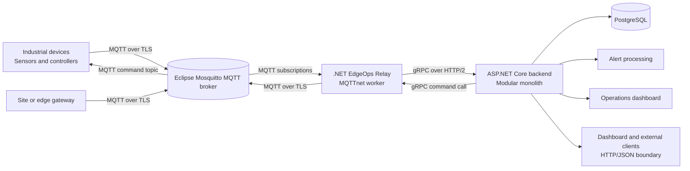

# EdgeOps Relay: Industrial Equipment Monitoring and Remote Control Platform

## Project and problem

EdgeOps Relay, an industrial monitoring and remote-control platform for maintenance staff, operations teams, administrators, and support staff. It connected distributed equipment such as refrigeration units, pumps, HVAC systems, generators, and solar installations to a shared operational view.

The product moved users from scattered telemetry, device events, and unreliable connections to searchable equipment state, alerts, configuration, and audited remote commands. MQTT-connected edge gateways handled device communication, while strongly typed C#/.NET gRPC services carried validated data into the backend.

EdgeOps Relay is a descriptive project name. Client identity and measured business outcomes are not included in this case study. The code excerpts show the delivered design rather than a complete runnable repository.

## Users and workflows

Distributed industrial equipment was separated across sites and connected through networks that were slow, intermittent, or difficult to operate. The product therefore used two complementary communication models:

1. **Asynchronous device communication** for telemetry, connectivity state, events, and commands across unreliable connections.
2. **Typed service communication** between the edge gateway and backend services, where the platform owned both sides of the interface and needed reliable contracts and streaming.

MQTT and gRPC handled these different boundaries rather than serving as universal replacements for every API technology.

The primary users are:

- Maintenance staff monitoring equipment health.
- Operations staff reviewing site and device status.
- Administrators registering gateways, devices, users, and permissions.
- Support staff investigating connectivity, commands, and audit history.

### Telemetry workflow

1. A device or local gateway publishes telemetry over MQTT using TLS.
2. The MQTT broker authenticates the client and routes the message to subscribed services.
3. The .NET Edge Gateway receives the message through MQTTnet.
4. The gateway validates the topic, device identity, payload version, and timestamp.
5. The gateway forwards normalized telemetry to the backend through a generated gRPC client.
6. The backend stores the durable measurement and updates the device's last-known state.
7. Alert rules evaluate the measurement and create an alert when a configured condition is met.
8. The dashboard displays current status, historical measurements, and alert activity.

### Remote-command workflow

1. An authorized operator selects a device and command in the dashboard.
2. The backend creates a command record with a stable command ID, expiry, and audit entry.
3. The command service publishes the command to the device's MQTT command topic.
4. The gateway or device receives the command and validates its identity, expiry, and safety rules.
5. The device executes the command only if its local safety interlocks permit it.
6. The device publishes an acknowledgement and result event.
7. The backend records the distinction between broker acceptance, gateway receipt, device execution, and final result.

A command being accepted by the MQTT broker does not prove that the equipment executed it.

## Selected technology stack

Open-source-first stack. Each technology served a specific boundary; the alternatives were not interchangeable products.

| Boundary                                   | Selected technology                     | Why it was selected                                                                                                        | Alternatives not selected for this implementation                                                                                                                                                                                                                                             |
| ------------------------------------------ | --------------------------------------- | -------------------------------------------------------------------------------------------------------------------------- | --------------------------------------------------------------------------------------------------------------------------------------------------------------------------------------------------------------------------------------------------------------------------------------------- |
| MQTT broker                                | Eclipse Mosquitto                       | Open-source, MQTT 5.0 support, TLS configuration, access controls, persistence, and a lightweight standalone broker model. | AWS IoT Core is a managed cloud service rather than a self-hosted open-source broker. HiveMQ Community Edition remained viable, but Mosquitto covered the defined broker scope. Current EMQX releases require edition and license review before they can be treated as an open-source choice. |
| .NET MQTT integration                      | MQTTnet as a client library             | Provides the C# client used by the edge worker and supports MQTT, TLS, TCP, and WebSockets.                                | The MQTTnet embedded server was not selected as the system broker because broker lifecycle and persistence must remain independent of the .NET application.                                                                                                                                   |
| Internal service API                       | ASP.NET Core gRPC with Protocol Buffers | Controlled service-to-service boundary, generated C# clients, explicit contracts, deadlines, and streaming.                | REST/JSON was not selected for the internal gateway contract; MQTT request/reply was not selected for synchronous backend calls because it would require a separate correlation, expiry, and response protocol.                                                                               |
| Browser and public API                     | HTTP/JSON endpoints                     | Broad browser and external-client compatibility without requiring generated gRPC-Web clients.                              | gRPC-Web remains technically viable, but it adds a browser-specific client and middleware path and does not support client- or bidirectional-streaming browser calls.                                                                                                                         |
| Durable server state                       | PostgreSQL                              | Central client/server database with relational constraints, transactions, SQL access, and durable application records.     | SQLite remains useful for edge-local storage, but it was not selected as the central shared database because SQLite's own guidance distinguishes local embedded storage from a shared client/server repository.                                                                               |
| Device payload in the illustrated contract | JSON over MQTT                          | Human-inspectable device messages and a payload contract independent of the backend's generated gRPC types.                | Protocol Buffers over MQTT is possible, but it was not selected for the illustrated device payload. No benchmark or device constraint justifies one encoding universally.                                                                                                                     |

## Architecture



Organize the product as a small number of deployable units:

1. **Edge Gateway** — a C# Worker Service that maintains MQTT connections, validates messages, handles reconnects, and calls backend gRPC services.
2. **Backend API** — an ASP.NET Core application exposing gRPC services for internal and edge communication, plus HTTP/JSON endpoints for the dashboard and external clients.
3. **Web dashboard** — the operator interface for devices, telemetry, alerts, commands, configuration, and audit history.
4. **Eclipse Mosquitto broker** — the self-hosted open-source broker responsible for device connections, topic routing, TLS transport, sessions, persistence, and MQTT delivery semantics.
5. **PostgreSQL** — the durable store for device identity, configuration, users, commands, alerts, audit records, and historical measurements.
6. **Alert processing** — a backend module that evaluates incoming telemetry against configured rules.

The backend remains a **modular monolith** in the initial implementation. The named gRPC services are logical service boundaries inside the application; they do not require every service to be deployed as a separate microservice.

### Broker selection

**Selected:** Eclipse Mosquitto as the standalone MQTT broker.

**Why:** Mosquitto is an Eclipse open-source project licensed under EPL/EDL. The project documents MQTT 5.0, MQTT 3.1.1, and MQTT 3.1 support, and describes Mosquitto as a lightweight broker suitable for low-power devices and full servers. Its broker configuration supports TLS listeners, authentication and authorization options, persistent sessions, retained messages, and broker status topics. [Eclipse Mosquitto](https://mosquitto.org/), [Mosquitto broker manual](https://mosquitto.org/man/mosquitto-8.html)

Mosquitto was selected because the product required a self-hosted open-source MQTT boundary, not because it was claimed to be the fastest broker or to provide automatic high availability. The selected deployment owns the broker's configuration, certificates, persistence files, monitoring, backups, upgrades, and recovery testing.

**Alternatives not selected:**

- **AWS IoT Core:** AWS documents MQTT 3.1.1 and MQTT 5 support, device connections, TLS, persistent sessions, and retained messages. It was not selected because it is an AWS-managed cloud service, not a self-hosted open-source broker. Its cloud operations model remains a valid alternative when outsourcing broker operations is more important than keeping the broker self-hosted. [AWS IoT Core MQTT](https://docs.aws.amazon.com/iot/latest/developerguide/mqtt.html)
- **HiveMQ Community Edition:** HiveMQ CE is a separate Apache-2.0 open-source broker with MQTT 3.x and MQTT 5 support. It remained a valid alternative, but no requirement in this project justified selecting it over Mosquitto. HiveMQ Enterprise and HiveMQ Cloud must not be conflated with CE; their extensions, licensing, and operating models are separate. [HiveMQ Community Edition](https://github.com/hivemq/hivemq-community-edition), [HiveMQ enterprise extensions](https://docs.hivemq.com/hivemq/latest/enterprise-extensions/index.html)
- **EMQX:** EMQX provides clustering documentation, but current release licensing is edition- and version-dependent. EMQX's licensing documentation identifies BSL 1.1 for versions from 5.9 and places conditions on community and commercial use. It was therefore not selected without a separate license and topology review. [EMQX licensing FAQ](https://www.emqx.com/en/content/license-faq)
- **MQTTnet embedded server:** MQTTnet includes an embeddable server, but the product selected MQTTnet as the .NET client and kept the broker as a separate process. This avoids coupling broker lifecycle, broker persistence, and broker recovery to the application worker. MQTTnet's embedded server remains useful for tests or a deliberately bounded single-process deployment. [MQTTnet](https://github.com/dotnet/MQTTnet)

**Trade-off accepted:** self-hosting Mosquitto keeps the broker open and under project control, but it does not outsource availability operations. The operating model therefore defined responsibilities for backup, persistence, certificate rotation, monitoring, restart behavior, and recovery procedures. Mosquitto bridging is a federation feature; it is not automatically equivalent to a highly available cluster.

## Why MQTT was used

MQTT 5.0 was selected for the device messaging contract. The OASIS specification defines MQTT clients, servers, sessions, subscriptions, topic filters, retained messages, will messages, and QoS behavior. Mosquitto documents support for MQTT 5.0 and the relevant session, TLS, authentication, authorization, persistence, and broker-status configuration. [OASIS MQTT 5.0 specification](https://docs.oasis-open.org/mqtt/mqtt/v5.0/os/mqtt-v5.0-os.html), [Mosquitto broker manual](https://mosquitto.org/man/mosquitto-8.html)

MQTT was appropriate at the device boundary because it provides:

- One long-lived connection rather than repeated HTTP polling.
- Broker-mediated fan-out to multiple consumers.
- Persistent sessions for reconnecting devices.
- Retained messages for last-known state or configuration.
- Last Will and Testament messages for unexpected disconnects.
- QoS 0 for data that may be missed and QoS 1 for data that must be delivered at least once.
- MQTT 5 features such as message expiry and reason codes supported by the selected broker.

HTTP polling, raw WebSockets, and native gRPC were not selected for the device boundary. HTTP polling would require each device to implement repeated request scheduling; raw WebSockets provide a transport but not MQTT's topic, session, QoS, retained-message, or Last Will semantics; and native gRPC would not provide the brokered publish/subscribe model used by the device fleet. These alternatives remain valid for other boundaries, but they do not replace the selected MQTT device contract.

MQTT is not a durable historical database. A retained message represents the latest value for a topic, not the complete measurement history. Retained commands are avoided by default because a stale actuation command should not execute merely because a device reconnects.

### MQTT topic contract

```text
sites/{siteId}/devices/{deviceId}/telemetry
sites/{siteId}/devices/{deviceId}/state
sites/{siteId}/devices/{deviceId}/commands
sites/{siteId}/devices/{deviceId}/events
sites/{siteId}/devices/{deviceId}/config
```

The topic hierarchy supports authorization rules and operational filtering. Topic ACLs must prevent a device from publishing to another tenant or subscribing to another device's command stream.

### MQTT delivery rules

MQTT QoS 1 is at-least-once delivery. A message can be delivered more than once, so the application uses an event ID, command ID, or equivalent idempotency key to prevent duplicate business processing. MQTT transport acknowledgement and business acknowledgement are separate concepts.

The platform also distinguishes:

- Broker accepted the message.
- Gateway received the message.
- Backend persisted the message.
- Device accepted the command.
- Equipment executed the command.

Online and offline status is derived from explicit heartbeats, MQTT Last Will messages, and a stale-state timeout. A green connection indicator does not mean that a device has recently reported valid telemetry.

## Why gRPC was used

gRPC is a contract-first RPC framework. Services and messages are defined in Protocol Buffer files, and generated clients and server base classes provide strongly typed communication across supported languages. The official gRPC documentation describes the model of calling a method on a remote service through a generated client. [gRPC introduction](https://grpc.io/docs/what-is-grpc/introduction/)

Microsoft provides first-class ASP.NET Core support through `Grpc.AspNetCore`, generated C# types through `Grpc.Tools`, dependency injection and logging integration, and `GrpcChannel` clients. [Microsoft ASP.NET Core gRPC](https://learn.microsoft.com/en-us/aspnet/core/grpc/?view=aspnetcore-10.0)

Use gRPC for the gateway-to-backend and backend-internal boundary because:

- Both ends of the contract were controlled by the platform.
- `.proto` files made the service contract explicit and versionable.
- C# clients and server types were generated instead of hand-maintained.
- Streaming was available for telemetry batches and long-running operations.
- Deadlines, cancellation, authentication, and status codes were part of the service model.
- Binary Protocol Buffer messages avoided unnecessary JSON translation between internal services.

These protocols are complementary. MQTT is not used as a replacement for gRPC service contracts, and gRPC is not used as a replacement for MQTT's brokered, asynchronous device delivery model.

<BlogCta />

### Browser and public API selection

**Selected:** HTTP/JSON endpoints for the dashboard and external clients. The backend may expose these as conventional ASP.NET Core endpoints or as JSON transcoding over annotated gRPC methods; both preserve an HTTP/JSON client contract.

**Why:** Browsers and general external clients can call HTTP/JSON without generating a gRPC client or adding a browser-specific transport path. ASP.NET Core JSON transcoding maps annotated gRPC methods to HTTP verbs, routes, and JSON request/response bodies. [ASP.NET Core JSON transcoding](https://learn.microsoft.com/en-us/aspnet/core/grpc/json-transcoding?view=aspnetcore-10.0)

**Alternative not selected as the primary boundary:** gRPC-Web. It is technically viable and can be enabled alongside native gRPC, but Microsoft documents the additional middleware and CORS configuration. Browser gRPC-Web clients support unary and server-streaming calls, but not client-streaming or bidirectional-streaming calls. [ASP.NET Core gRPC-Web](https://learn.microsoft.com/en-us/aspnet/core/grpc/grpcweb?view=aspnetcore-8.0) The product's browser boundary did not require that extra path, so gRPC-Web remains an optional compatibility mode rather than the selected public API.

Native HTTP/2 gRPC was not exposed directly to browsers. It remains the internal service protocol, while the dashboard and external clients use HTTP/JSON.

## Service boundaries

The backend exposed logical services with responsibilities such as:

| Service                     | Responsibility                                                                            |
| --------------------------- | ----------------------------------------------------------------------------------------- |
| `DeviceRegistryService`     | Register sites, gateways, devices, capabilities, credentials, and configuration metadata. |
| `TelemetryIngestionService` | Receive validated telemetry batches and device events from gateways.                      |
| `CommandService`            | Create, authorize, publish, expire, and track remote commands.                            |
| `AlertService`              | Manage alert rules, alert state, acknowledgement, and notification workflows.             |
| `ConfigurationService`      | Read and update device and gateway configuration.                                         |
| `AuditService`              | Record operator actions, service events, and command state changes.                       |

These are application boundaries, not an instruction to operate six separate services. Keeping them in one ASP.NET Core deployment reduced deployment and process boundaries while preserving clear contracts.

### Internal communication selection

**Selected:** native gRPC with Protocol Buffers between the Edge Gateway and backend, and direct C# method calls between modules inside the same backend process.

**Alternatives not selected:** REST/JSON would be valid for an external API, but it was not selected for the controlled gateway contract because the implementation already owned both sides and required generated C# contracts and streaming. MQTT request/reply would be possible, but it would introduce a separate correlation, expiry, response, and failure-state protocol for calls that are synchronous from the backend's perspective. Independent microservices were not selected for each logical service because the product did not require separate deployment, scaling, or ownership boundaries.

## Illustrative Protocol Buffer contract

The following excerpt shows the shape of a telemetry and command contract. It is intentionally small; production contracts also need explicit versioning, validation rules, authorization metadata, and compatibility policy.

The selected encoding is deliberately split by boundary: JSON is used in the illustrated MQTT device payload so that field values can be inspected with standard MQTT tools, while Protocol Buffers are used for the controlled gateway/backend gRPC contract. Protocol Buffers over MQTT would also be valid, but this documented choice prioritised inspectability rather than claiming a universal performance advantage.

```protobuf
syntax = "proto3";

package edgeops.v1;

import "google/protobuf/timestamp.proto";

service TelemetryIngestion {
  rpc StreamTelemetry(stream TelemetryBatch)
      returns (TelemetryAck);
}

service DeviceCommand {
  rpc SendCommand(CommandRequest)
      returns (CommandResult);
}

message TelemetryBatch {
  string gateway_id = 1;
  repeated TelemetryReading readings = 2;
}

message TelemetryReading {
  string device_id = 1;
  string event_id = 2;
  google.protobuf.Timestamp observed_at = 3;
  map<string, double> values = 4;
}

message TelemetryAck {
  repeated string accepted_event_ids = 1;
  repeated string duplicate_event_ids = 2;
}

message CommandRequest {
  string command_id = 1;
  string device_id = 2;
  string command_name = 3;
  bytes arguments = 4;
  google.protobuf.Timestamp expires_at = 5;
}

message CommandResult {
  string command_id = 1;
  enum Status {
    STATUS_UNSPECIFIED = 0;
    ACCEPTED = 1;
    REJECTED = 2;
    EXECUTED = 3;
    FAILED = 4;
    EXPIRED = 5;
  }
  Status status = 2;
  string detail = 3;
}
```

The command ID is intentionally part of the application contract. A network retry must not accidentally turn one operator action into two equipment actions.

## Illustrative MQTTnet gateway code

MQTTnet provides the selected .NET MQTT client integration and also includes an optional embeddable server implementation. The EdgeOps Relay implementation uses MQTTnet as a client; Eclipse Mosquitto remains the standalone broker. MQTTnet supports MQTT communication up to MQTT 5 and provides TCP, TLS, and WebSocket client channels. [MQTTnet repository](https://github.com/dotnet/MQTTnet)

The following C# excerpt illustrates the gateway responsibilities: connect securely, subscribe to a device topic, parse an event ID, and forward the message to an internal application handler. The exact MQTTnet package version and project-specific dependency registration are omitted, so this is an implementation excerpt rather than a copy-paste complete program. The connection example selects MQTT 5.0 and expresses a persistent-session intent; an actual deployment must set the MQTT 5 session-expiry policy and validate broker queue limits explicitly.

```csharp
using System.Text.Json;
using MQTTnet;
using MQTTnet.Client;
using MQTTnet.Formatter;

public sealed class TelemetryMqttWorker : BackgroundService
{
    private readonly IMqttClient _mqtt;
    private readonly ITelemetryIngestionClient _telemetry;
    private readonly ILogger<TelemetryMqttWorker> _logger;

    public TelemetryMqttWorker(
        IMqttClient mqtt,
        ITelemetryIngestionClient telemetry,
        ILogger<TelemetryMqttWorker> logger)
    {
        _mqtt = mqtt;
        _telemetry = telemetry;
        _logger = logger;
    }

    protected override async Task ExecuteAsync(CancellationToken stoppingToken)
    {
        _mqtt.ApplicationMessageReceivedAsync += OnMessageAsync;

        var options = new MqttClientOptionsBuilder()
            .WithClientId("edge-gateway-001")
            .WithProtocolVersion(MqttProtocolVersion.V500)
            .WithTcpServer("mqtt.example.internal", 8883)
            .WithTlsOptions(_ => { /* certificate validation is configured here */ })
            .WithCleanSession(false) // persistent-session intent; set MQTT 5 expiry explicitly
            .Build();

        await _mqtt.ConnectAsync(options, stoppingToken);

        var filter = new MqttTopicFilterBuilder()
            .WithTopic("sites/+/devices/+/telemetry")
            .WithAtLeastOnceQoS()
            .Build();

        await _mqtt.SubscribeAsync(filter, stoppingToken);

        await Task.Delay(Timeout.InfiniteTimeSpan, stoppingToken);
    }

    private async Task OnMessageAsync(
        MqttApplicationMessageReceivedEventArgs args)
    {
        try
        {
            var telemetry = JsonSerializer.Deserialize<TelemetryMessage>(
                args.ApplicationMessage.PayloadSegment);

            if (telemetry is null || string.IsNullOrWhiteSpace(telemetry.EventId))
            {
                _logger.LogWarning("Rejected telemetry without an event ID");
                return;
            }

            await _telemetry.IngestAsync(telemetry);
        }
        catch (Exception exception)
        {
            _logger.LogError(exception, "Telemetry message processing failed");
            throw;
        }
    }
}
```

The gateway design also accounted for reconnect handling, bounded queues, backpressure, payload-size limits, schema validation, structured error handling, duplicate detection, certificate rotation, and a clear policy for messages that could not be persisted.

## Illustrative ASP.NET Core gRPC registration

The ASP.NET Core backend maps generated service implementations while keeping the dashboard-facing HTTP boundary separate.

```csharp
var builder = WebApplication.CreateBuilder(args);

builder.Services.AddGrpc(options =>
{
    options.EnableDetailedErrors = false;
});

builder.Services.AddAuthentication();
builder.Services.AddAuthorization();
builder.Services.AddSingleton<TelemetryStore>();
builder.Services.AddSingleton<CommandStore>();

var app = builder.Build();

app.UseAuthentication();
app.UseAuthorization();

app.MapGrpcService<TelemetryIngestionService>();
app.MapGrpcService<DeviceCommandService>();
app.MapGrpcService<DeviceRegistryService>();

app.MapGet("/health", () => Results.Ok(new { status = "ok" }));

app.Run();
```

Generated C# clients use a long-lived gRPC channel. Calls should include deadlines and cancellation tokens, and retry policies should only retry operations that are safe to repeat.

```csharp
using Grpc.Net.Client;
using EdgeOps.V1;

using var channel = GrpcChannel.ForAddress("https://edgeops-backend.internal");
var client = new TelemetryIngestion.TelemetryIngestionClient(channel);

using var deadline = new CancellationTokenSource(TimeSpan.FromSeconds(10));
using var call = client.StreamTelemetry(
    deadline: DateTime.UtcNow.AddSeconds(10),
    cancellationToken: deadline.Token);

await call.RequestStream.WriteAsync(telemetryBatch);
await call.RequestStream.CompleteAsync();
var response = await call.ResponseAsync;
```

The exact generated method shape depends on whether the call is unary, client-streaming, server-streaming, or bidirectional streaming. The service contract, deadline policy, and idempotency rules remain more important than the method syntax.

## Storage and durability boundaries

**Selected:** PostgreSQL as the central server database.

**Why:** The backend has shared relational state for devices, commands, alerts, permissions, and audit records. PostgreSQL provides the client/server database model, transactions, relational constraints, and SQL access needed for these records. Durability still depends on WAL settings, storage, backups, replication, and recovery testing; selecting PostgreSQL alone does not prove a completed disaster-recovery design. [PostgreSQL WAL settings](https://www.postgresql.org/docs/current/runtime-config-wal.html)

**Alternative not selected:** SQLite remains a valid open-source embedded database for device-local storage, gateway buffering, tests, and single-process applications. SQLite's own guidance distinguishes local embedded storage from a shared client/server repository and recommends a client/server database when the database is on a separate device or many concurrent writers need coordination. It was therefore not selected as the central shared server database, not because SQLite is categorically unsuitable for production. [SQLite: Appropriate Uses for SQLite](https://www.sqlite.org/whentouse.html)

PostgreSQL stores durable application state, including:

- Sites, gateways, devices, and capabilities.
- Device credentials and certificate metadata.
- Current device state and last-seen timestamps.
- Telemetry measurements and their event IDs.
- Commands, command expiry, and command results.
- Alert rules, alert instances, and acknowledgement state.
- User permissions and audit records.

The MQTT broker provides transport, routing, sessions, and retained last-known values. It is not treated as the permanent system of record for historical telemetry.

The design defined a failure policy for each boundary:

| Failure                     | Handling                                                                                                                               |
| --------------------------- | -------------------------------------------------------------------------------------------------------------------------------------- |
| Device loses connectivity   | MQTT reconnect, persistent session where appropriate, heartbeat timeout, and offline state.                                            |
| Broker is unavailable       | Gateway reconnect with backoff and bounded local buffering. Messages exceeding the buffer policy are surfaced as an operational error. |
| Backend is unavailable      | Gateway retains only the bounded amount of data explicitly supported by its local queue policy.                                        |
| Database write fails        | Do not acknowledge durable ingestion until the persistence policy is satisfied. Alert operators when data cannot be stored.            |
| gRPC call times out         | Apply a deadline and retry only when the operation is idempotent or has a stable request ID.                                           |
| Command response is delayed | Keep the command in an explicit pending state until it expires or a result arrives.                                                    |

No transport-level feature guarantees exactly-once business processing. Exactly-once effects require application-level IDs, deduplication, transactional state changes, and command expiry.

## Security model

The implementation treats transport security, client identity, authorization, and operational safety as separate concerns.

### Device and gateway identity

- MQTT connections use TLS.
- Devices and gateways receive individual identities rather than sharing one global credential.
- Broker ACLs limit publish and subscribe access by tenant, site, gateway, and device.
- Credential and certificate rotation are managed independently from application authorization.
- The backend maps the authenticated gateway identity to the devices it is allowed to represent.

### Backend and dashboard authorization

- gRPC calls authenticate the gateway or internal service.
- Dashboard users receive role-based permissions.
- Device commands require explicit authorization.
- Every operator command creates an audit record.
- Tenant and site boundaries are enforced in the service layer and database queries.

### Equipment safety

Remote commands remain subject to equipment-local safety interlocks. This software architecture does not establish safety certification and must not bypass local protections. Commands are validated for identity, schema, authorization, expiry, and allowed operating conditions before they are forwarded.

## Reliability and observability

The platform exposes health and operational information for:

- MQTT connection state.
- Last gateway heartbeat.
- Last device telemetry timestamp.
- Broker publish and delivery errors.
- MQTT reconnect count and backoff state.
- gRPC call duration, deadlines, and status codes.
- Telemetry validation failures.
- Duplicate event count.
- Command pending, expired, executed, and failed counts.
- Database write failures.
- Alert evaluation failures.

Structured logs include correlation IDs, gateway IDs, device IDs, event IDs, and command IDs. Sensitive payload fields are excluded or redacted.

The dashboard distinguishes current state from stale state. A retained MQTT message is useful for quickly showing the last reported value, but the UI also shows when that value was observed and whether it has exceeded the freshness threshold.

## Deployment structure and operational ownership

The implementation avoided unnecessary process and infrastructure boundaries while preserving clear responsibilities:

- One .NET edge worker instead of a separate service for every device protocol.
- One ASP.NET Core backend with logical gRPC service modules and direct in-process calls between modules.
- One self-hosted Eclipse Mosquitto broker instead of a managed cloud broker or an embedded broker coupled to the application.
- PostgreSQL as the main durable server store, with explicit backup and recovery responsibilities.
- Generated Protocol Buffer code instead of hand-written internal clients.
- An HTTP/JSON boundary instead of exposing native gRPC directly to browsers.
- Explicit retry, deduplication, expiry, and audit rules instead of claiming that transport delivery alone guarantees business correctness.

Selecting Mosquitto assigned the deployment responsibility for broker configuration, TLS certificates, ACLs, persistence files, monitoring, backups, upgrades, restart behavior, and recovery drills. Automatic high availability is not part of the described deployment.

## Production and project precedents

The following systems show established uses of the selected technology patterns. They are external precedents, not descriptions of EdgeOps Relay's deployment or results.

### Google internal services and gRPC

Google's SRE book describes an internal RPC infrastructure called Stubby and notes that open-source gRPC is available as its public implementation. It also describes Protocol Buffers as the data format used for RPC communication. [Google SRE](https://sre.google/sre-book/production-environment/)

The relevant lesson for EdgeOps Relay is not to reproduce Google's infrastructure. It is to use explicit service contracts and RPC where the communicating services are controlled by the same product team.

### AWS IoT Core

AWS IoT Core is a managed IoT product that supports device connections using MQTT and MQTT over WebSockets. Its documentation covers TLS, QoS, persistent sessions, retained messages, last-will messages, and MQTT 5 behavior. [AWS MQTT documentation](https://docs.aws.amazon.com/iot/latest/developerguide/mqtt.html)

This demonstrates production use of MQTT device messaging and documents features available in AWS IoT Core. AWS IoT Core was not part of the selected EdgeOps Relay stack because this implementation uses a self-hosted open-source broker.

### ChirpStack

ChirpStack is an open-source LoRaWAN network server with a gRPC-based API and MQTT integration. Its MQTT integration publishes device data over MQTT and accepts downlink scheduling through MQTT topics. [ChirpStack repository](https://github.com/chirpstack/chirpstack), [ChirpStack MQTT integration](https://www.chirpstack.io/docs/chirpstack/integrations/mqtt.html), [ChirpStack API documentation](https://www.chirpstack.io/docs/chirpstack/api/api.html)

ChirpStack is a useful public precedent for combining an MQTT device/data boundary with a gRPC management and integration API. It is an external reference, not part of EdgeOps Relay.

### MQTTnet and ASP.NET Core

MQTTnet provides the C# MQTT implementation used as the basis for the edge worker. ASP.NET Core provides the gRPC hosting and generated-client integration used for backend communication. [MQTTnet](https://github.com/dotnet/MQTTnet), [Microsoft ASP.NET Core gRPC](https://learn.microsoft.com/en-us/aspnet/core/grpc/?view=aspnetcore-10.0)

## Completed outputs

Final Outcome:

- A device and gateway registration model.
- MQTT topic conventions for telemetry, state, commands, events, and configuration.
- TLS-secured MQTT communication.
- MQTT-based telemetry and device-event ingestion.
- Gateway-to-backend gRPC contracts.
- Protocol Buffer message definitions.
- C#/.NET edge-worker and ASP.NET Core backend structure.
- Device online/offline state handling.
- Last-known state through retained MQTT messages where appropriate.
- Durable telemetry, command, alert, configuration, and audit records.
- Alert rules and alert state management.
- Remote command workflow with stable IDs, expiry, acknowledgement, and result tracking.
- Duplicate-event handling for at-least-once delivery.
- HTTP/JSON access for the browser and external-client boundary; gRPC-Web remains an optional compatibility path, not the selected primary API.
- Structured logging, health checks, metrics, and operational diagnostics.
- Security boundaries for device identity, TLS, topic ACLs, user authorization, and tenant isolation.
- A modular-monolith deployment model appropriate for a focused development and operations team.

## Conclusion

EdgeOps Relay as one product with two communication paths. MQTT handled distributed equipment, intermittent connectivity, brokered fan-out, retained state, and asynchronous device events. gRPC handled the strongly typed service boundary between the .NET edge gateway and backend.

The delivered platform gave maintenance and operations users a shared route from device telemetry and events to searchable state, alerts, configuration, and audited remote commands. C#/.NET connected the gateway, backend, generated clients, authentication, logging, and operational tooling in one implementation ecosystem.

## Sources

- [gRPC introduction](https://grpc.io/docs/what-is-grpc/introduction/) — gRPC service model, Protocol Buffers, and generated clients.
- [Google SRE: Production Environment](https://sre.google/sre-book/production-environment/) — Google's production RPC and Protocol Buffer context.
- [Microsoft ASP.NET Core gRPC](https://learn.microsoft.com/en-us/aspnet/core/grpc/?view=aspnetcore-10.0) — ASP.NET Core hosting and C# tooling.
- [AWS MQTT documentation](https://docs.aws.amazon.com/iot/latest/developerguide/mqtt.html) — managed-service MQTT behavior and production product context.
- [OASIS MQTT 5.0 specification](https://docs.oasis-open.org/mqtt/mqtt/v5.0/os/mqtt-v5.0-os.html) — protocol definitions for clients, servers, sessions, subscriptions, QoS, and will messages.
- [Eclipse Mosquitto](https://mosquitto.org/) — selected open-source MQTT broker.
- [Mosquitto broker manual](https://mosquitto.org/man/mosquitto-8.html) — supported MQTT versions and broker configuration behavior.
- [HiveMQ Community Edition](https://github.com/hivemq/hivemq-community-edition) — open-source broker alternative distinguished from HiveMQ Enterprise and Cloud.
- [HiveMQ enterprise extensions](https://docs.hivemq.com/hivemq/latest/enterprise-extensions/index.html) — edition boundary for commercial extensions.
- [EMQX licensing FAQ](https://www.emqx.com/en/content/license-faq) — version- and edition-dependent licensing alternative.
- [MQTTnet repository](https://github.com/dotnet/MQTTnet) — selected .NET MQTT client and optional embedded server.
- [ASP.NET Core JSON transcoding](https://learn.microsoft.com/en-us/aspnet/core/grpc/json-transcoding?view=aspnetcore-10.0) — selected HTTP/JSON browser boundary option.
- [ASP.NET Core gRPC-Web](https://learn.microsoft.com/en-us/aspnet/core/grpc/grpcweb?view=aspnetcore-8.0) — optional browser compatibility alternative.
- [PostgreSQL WAL settings](https://www.postgresql.org/docs/current/runtime-config-wal.html) — durable server-state considerations.
- [SQLite: Appropriate Uses for SQLite](https://www.sqlite.org/whentouse.html) — embedded database alternative and client/server boundary guidance.
- [ChirpStack repository](https://github.com/chirpstack/chirpstack) — open-source LoRaWAN network server with a gRPC API.
- [ChirpStack MQTT integration](https://www.chirpstack.io/docs/chirpstack/integrations/mqtt.html) — MQTT device-data and downlink integration.
- [ChirpStack API documentation](https://www.chirpstack.io/docs/chirpstack/api/api.html) — generated API contract documentation.
